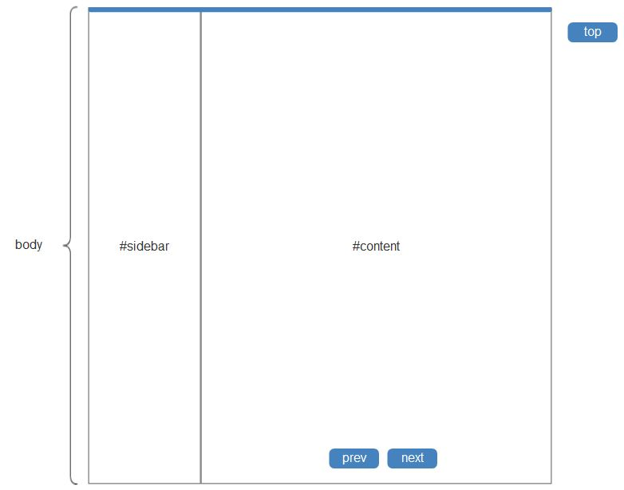

# mark2web是如何工作的?  

## 核心功能
当你进入该站的时，由服务器默认打开 `index.html` 文件，其中引入的 `mark2web.js` 脚本会请求加载 `sidebar.md` 和 `README.md` 文件，使用 [marked][marked_github] 将Markdown文件（后缀名为.md）渲染为HTML文件，并分别展示到 `#sidebar` 和 `#content` 中。

页面布局如下图所示：

上一节讲到，在 `sidebar.md` 文件中以如下格式定义要链接的其他文档：

    #docs/file_name_without_extension

当你点击该链接时，hash值将会被解析和处理为其文档所在的相对地址，示意如下：

    From:                         To:
    #docs/document_1 -----------> docs/document_1.md

然后使用 [jQuery][jquery] 向服务器发起一个 `GET` 请求用于获取该Markdown文件，然后同样的使用 [marked][marked_github] 将该Markdown文件渲染为HTML文件，并展示到 `#content` 中。

## 其他功能
`mark2web` 还提供其他的辅助功能，如下：

- 进度条展示当前阅读进度（功能可选）
- prev/next章节跳转（功能可选）
- 返回顶部（功能可选）
- 代码高亮（功能可选）
- 自动提取h2标题至页面顶部，以提供页内导航功能
- 规范image路径

### 自动提取h2标题至页面顶部，以提供页内导航功能
由Markdown渲染为HTML文件后，在页面顶部 `<h1>` 标题为所有的 `<h2>` 标题创建一个对应的 `<li>` 元素，并在该元素上添加 `click` 事件的监听函数，当你点击 `<li>` 元素时，页面会自动滚动到对应的 `<h2>` 的所在区域，同时标题字体颜色会在短时间内变为红色以吸引用户的注意力。

### 规范image路径
前一节讲到文件结构时，不知道你是否有注意到 `docs` 文件夹下还有一个 `images` 文件夹，用于编辑Markdown文件时链接图片。  
例如，当你在编辑 `docs/some_doc.md` 文件时，准备链接一个 `docs/images/image_1.jpg` 图片，在Markdown中会这样写： 

    

很抱歉，图片并不会成功加载，因为服务器的根目录是 `/` ，服务器会去寻找 `images` 目录下 `image_1.jpg` 文件，而 `images` 目录是一个根本不存在的目录。

为解决这个问题， `mark2web` 对图片链接做了处理，对于来自网络即以 `http` 或 `https` 开头的图片链接予以过滤不做处理，其余图片链接均简单的增加 `docs/` 前缀。

[marked_github]: https://github.com/chjj/marked
[jquery]:http://jquery.com/ 
